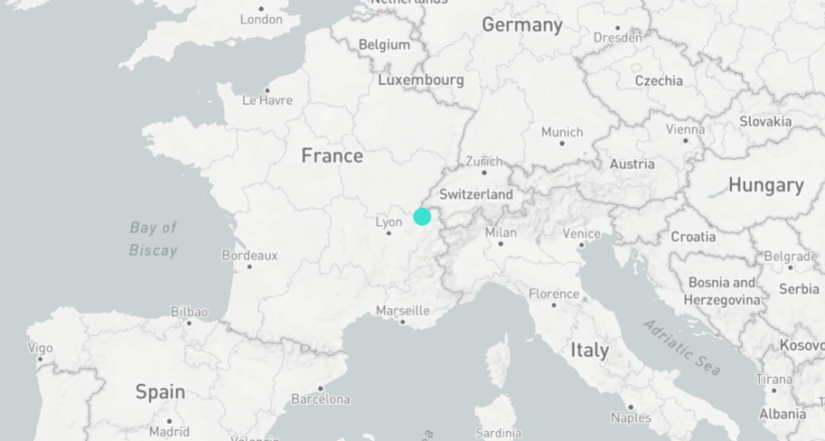

A D3.js and Mapbox Minimal Example
----------------------------------

A simple example of how D3.js can be used on top of a Mapbox map.

The example can be viewed by starting a local web server, for example, with:
```bash
python3 -m http.server 4000
```

Then, in this case, you have to visit [http://localhost:4000](http://localhost:4000)



On every drag/zoom event the data (in this case a single point pointing to the city of Geneva) is re-projected from the latitude/longitude space to the SVG space (in Cartesian coordinates), which lays on top of the map layer. D3's data bindings are then used to re-draw the data by mapping the projected data to the DOM elements of the SVG layer.